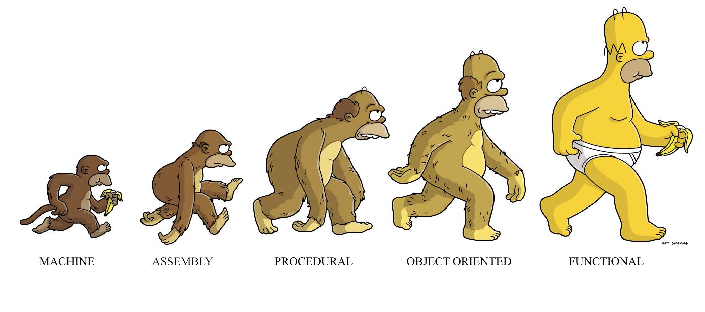

In computer science, functional programming is a programming paradigm or pattern (a style of building the structure and elements of computer programs).

So many languages adopted this programming style. JavaScript, Haskell, Clojure, Erlang, and Scala are the most popular among them.

And with its ability to pass and return functions, it brought so many concepts:
- Pure Functions
- Currying
- Higher-Order functions

And in this blog post, we are going to deep dive into the concept of **Currying**.
Its implementation and usage in Javascript.

## What is Currying?

[Currying](https://en.wikipedia.org/wiki/Currying) is an advanced technique of working with functions. It’s used not only in JavaScript, but in other languages as well.

Currying is a transformation of functions that translates a function from callable as f(a, b, c) into callable as f(a)(b)(c).

> **NOTE :** Currying doesn’t call a function. It just transforms it. 

 Let’s take an example first, to better understand what we’re talking about, and then we will look into its practical applications.

We’ll create a helper function curry(f) that performs currying for a two-argument function 'f'. In other words, curry(f) for two-argument f(a, b) translates it into a function that runs as f(a)(b):

  
>  <pre> 
> function curry(f) { 
> // curry(f) does the currying transform
> return function(a) {
>   return function(b) {
>     return f(a, b);
>    };
>  }; 
> } 
>   
>// usage
>function sum(a, b) {
>  return a + b;
>}
>   
>let curriedSum = curry(sum);
>console.log(curriedSum(1)(2) ); // 3
> </pre>

As you can see, the implementation is straightforward: it’s just two wrappers.

- The result of curry(func) is a wrapper function(a).
- When it is called like curriedSum(1), the argument is saved in the Lexical Environment, and a  new wrapper is returned function(b).
- Then this wrapper is called with 2 as an argument, and it passes the call to the original sum.

More advanced implementations of currying, such as _.curry from lodash library, return a wrapper that allows a function to be called both normally and partially

So using concept of currying we can send one argument at some time, and then may be spice it up with another at some later stage and user the final result by passing another at the end.

Now, that we have some basic understanding of what Currying actually does, let's see how we can use it in javascript.

## Currying using bind()

> <pre>
>  let multiply = function (x,y) {
>  console.log(x*y);
>  }  
>    
> let multiplyByTwo 
>        = multiply.bind(this,2);
> multiplyByTwo(5); // 10
>
> let multiplyByThree 
>        = multiply.bind(this,3);
> multiplyByThree(5) // 15
>
> let multiplyByFour 
>        = multiply.bind(this,4);
> multiplyByFour(5) // 20;
>
> .... and so on
> </pre>   

So if you observe the above example carefully, we very intelligently implemented currying using bind.
Since bind method creates a copy of the method which can be invoked later, using the same concept we derived other methods by pre-setting some of the arguments.

See below explaination to get a clear picture

> <pre>   
> let multiplyByTwo = 
>       multiply.bind(this,2);     
> 
> // this bind method created 
> // a copy of this multiply method
> // and preset the value of x as 2,
> // which we passed in the argument.
>
> let multiplyByTwo = function (y) {   
>    let x = 2;   
>    console.log(x*y);   
> }   
> </pre>   

## Currying using Closures

What is a closure?

A closure is the combination of a function bundled together (enclosed) with references to its surrounding state (the lexical environment). In other words, a closure gives you access to an outer function’s scope from an inner function. In JavaScript, closures are created every time a function is created, at function creation time.

> <pre>   
>   let multiply = function(x){
>     return function(y){
>         console.log(x*y);
>      }
>   }
> 
>    multiply(2)(3); // 6
>    // and similarly we can
>     //create functions here also
>
>    let multiplyByTwo = multiply(2);
>    multiplyByTwo(5); // 10
>
>    let multiplyByThree = multiply(3);
>    multiplyByThree(5) // 15
>
>    let multiplyByFour = multiply(4);
>    multiplyByFour(5) // 20;
>    .... and so on
> </pre>  

In this function, when new finction is returned, this inner function will still have access to outer variable. So just like our previous example, this is like pre-setting the value of x here.
And this is possible because of the concept of **"Closures"**.

### Summary

Yes, That is all about currying for now.
To summarize,

 - Closure makes currying possible in JavaScript.
 - It’s ability to retain the state of functions already executed, gives us the ability to create factory functions — functions that can add a specific value to their argument.
 - Using Currying, we can derive other methods, by pre-setting some values as we have seen in both the examples.

  Using currying, we can pass arguments in our app at different places and genrate output somewhere else. It is be quite tricky to wrap your head around currying, closures and functional programming. But I assure you with time and practice, you will start to get the hang of it and see its worth.

If you have any questions regarding this post or anything I should add, correct or remove, feel free to get in touch at my instagram handle [@init.js](https://www.instagram.com/init.js/)

Thanks !!!